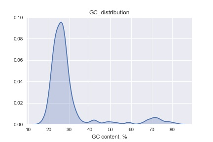
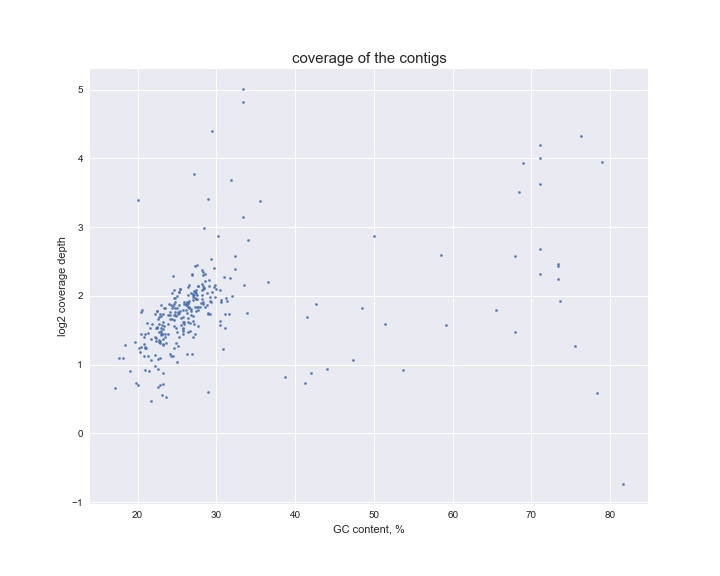

`fetch_seq()` downloads sequences in fasta or genbank format from NCBI nucleotide database

`fasta_info()` prints out information about fasta sequences: number of records within a file, their length and GC content

`split_fasta()` splits fasta file containing multiple records into the corresponding number of fasta files

`cat_fasta()` concatenates sequece records from one multifasta file or several files into one sequence and writes it as fasta

`plot_contigs_cover_gc()` takes SPAdes assembler output (fasta file containing contigs) and creates two plots: GC distribution and GC content vs contigs coverage:

`blast_fasta()` blasts sequences from fasta file using nucleotide blas and saves results as a tab-delimited text file
